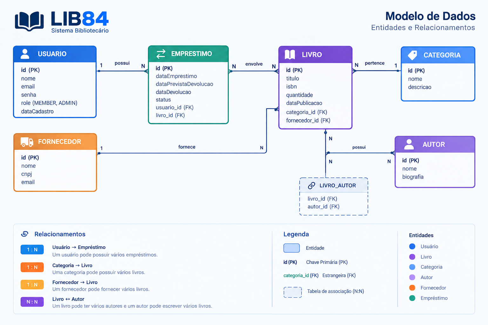

# LIB84 - API RESTful em Java com Spring Boot

- A API é para uso em sistemas de gestão de livros, desenvolvida utilizando a linguagem de programação Java com recursos do Spring Boot. Abaixo, segue status de desenvolvimento, stack e requisitos.

> 🚧 **Status:** Em desenvolvimento

## Estrutura do Repositório

- **API-REST-SPRING-BOOT**: Armazena o código da API (backend);

## Stack Ferramental

- **Backend:** Java 17+, Spring Boot, Spring Web, Spring Data JPA (ORM).
- **Banco de dados:** H2 Database.
- **Gerenciamento de Dependências:** Maven. 
- **Validação:** Bean Validation.
- **Documentação:** Swagger

## Conceitos

- WebServices;
- REST;
- Validação de dados;
- Documentação API com Swagger;

## Solicitado

- Mínimo de 5 entidades com relacionamentos entre si
- Pelo menos um relacionamento de cada tipo: One-to-One, One-to-Many e Many-to-Many
- Utilizar validações adequadas (Bean Validation) em cada entidade
- Implementar pelo menos um enum em uma das entidades
- Mínimo de 5 endpoints REST para cada entidade
- Implementar operações CRUD completas para cada entidade
- Todas as rotas de listagem devem ser paginadas (utilizando Pageable)
- Incluir pelo menos 1 endpoint com consultas personalizadas por entidade
  - GET /users/search?email= — buscar usuário por email
  - GET /profiles/user/{userId} — perfil pelo ID do usuário
  - GET /categories/search?title= — buscar categoria por título
  - GET /suppliers/search?name= — buscar fornecedor por nome
  - GET /authors/search?name= — buscar autor por nome
  - GET /books/category/{categoryId} — livros por categoria
  - GET /loans/user/{userId} — empréstimos por usuário
- Utilizar códigos de status HTTP apropriados para cada operação
- Documentar todos os endpoints usando Springdoc OpenAPI (Swagger)
  - Incluir descrições detalhadas, exemplos e possíveis códigos de resposta
  - Garantir que a documentação esteja completa e precisa
- Implementar HATEOAS utilizando Spring HATEOAS
- Incluir links relevantes nas respostas (self, update, delete, etc.)
- Garantir navegabilidade entre recursos da API
- Utilizar EntityModel, CollectionModel ou PagedModel quando aplicável
- Idempotência
- Autenticação com Chave de API
- Rate Limiting
- CORS (Cross-Origin Resource Sharing)
- Versionamento da API (X-API-Version)
- Validações e Tratamento de Erros
- Documentação com Swagger/OpenAPI

## Tarefas (P1)

- [x] Utilizar o framework Spring Boot em sua versão mais recente
- [x] Implementar o projeto com Java 17 ou superior
- [x] Utilizar o Maven ou Gradle como gerenciador de dependências (Maven)
- [x] Configurar o banco de dados H2 para persistência de dados
- [x] Utilizar Spring Data JPA para ORM

## Documentação de Negócio

## Estrutura do Banco de Dados

### Entidades

- Usuário
- Perfil
- Livro
- Categoria
- Fornecedor
- Autor
- Empréstimo

### Requisitos Funcionais (RF)

- [x] O usuário deve poder se cadastrar;
- [ ] O usuário deve poder se logar;
- [ ] O usuário deve poder resetar a senha;
- [x] O usuário deve poder realizar um empréstimo;
- [x] O usuário deve poder visualizar todos os livros;
- [x] O usuário deve poder visualizar suas informações de perfil;
- [x] O usuário deve poder visualizar o histórico de empréstimos;
- [x] O administrador deve poder registrar um fornecedor;
- [x] O administrador deve poder registrar uma categoria;
- [x] O administrador deve poder registrar um livro;
- [x] O administrador deve poder registat um autor;
- [x] O administrador deve poder deletar um fornecedor;
- [x] O administrador deve poder deletar uma categoria;
- [x] O administrador deve poder deletar um livro;
- [x] O administrador deve poder deletar um autor;
- [x] O usuário deve poder deletar a própria conta;
- [x] O usuário deve poder atualizar seu usuário (email/senha)
- [x] O usuário deve poder atualizar as informações de seu perfil;
- [x] O usuário deve poder atualizar seu empréstimo;
- [ ] O usuário deve poder visualizar livros agrupados por autor/categoria/fornecedor;
- [x] O usuário deve poder visualizar todas as categorias;
- [ ] O usuário deve poder visualizar a quantidade de livros por categoria;
- [ ] O usuário deve poder filtrar seu histórico de empréstimos por período e por categoria;
- [x] O administrador deve poder visualizar todos os usuários.

### Requisitos Não-Funcionais (RNF)

- [x] A senha do usuário precisa estar em formato hash;
- [x] Os dados da aplicação precisam estar persistidos em um banco H2;
- [x] Todas as listas de dados precisam estar paginadas com 10 itens por página; 
- [ ] O usuário deve ser identificado por um JWT (JSON Web Token) entre as requisições;
- [x] Todos os usuários devem ser identificados pela permissão de "membro" ou "admin";
- [ ] O sistem deve ter rate limiting;
- [x] O sistema deve possuir tratamento centralizado de erros;
- [x] O administrador não pode visualizar senhas dos usuários.
- [x] Todas as rotas precisam estar documentadas utilizando o swagger;
- [ ] O sistema deve implementar refresh token para renovação de autenticação;
- [ ] Invalidar o JWT ao deletar a conta do usuário.

### Regras de Negócio (RN)

- [x] O usuário não deve poder se cadastrar com e-mail duplicado;
- [ ] O administrador não deve poder cadastrar categorias com o mesmo título;
- [ ] O administrador não deve poder cadastrar mais que 15 categorias;
- [ ] O token de reset de senha deve expirar em 15 minutos e só pode ser usado uma vez;
- [ ] O usuário que solicitou renovação de senha não pode cadastrar a mesma senha novamente;
- [ ] O usuário não deve poder solicitar empréstimo para outro usuário;
- [ ] O usuário só pode visualizar os próprios empréstimos;
- [ ] O administrador não deve poder atualizar o livro com a mesma categoria já em uso pelo próprio livro;
- [x] Os usuários, por padrão, recebem o cargo (permissão) de "membro";
- [ ] O usuário não deve poder visualizar empréstimos de outros usuários;
- [x] O administrador pode visualizar todos os usuários;
- [ ] Ao deletar uma conta, os empréstimos vinculados ao usuário devem ser mantidos.

## Banco de dados

### Fluxograma

### Relacionamento

- Um usuário pode possuir vários empréstimos. Cada empréstimo pertence a exatamente um usuário (One-to-Many).
- Uma categoria pode possuir vários livros. Cada livro pertence a uma categoria (One-to-Many).
- Um fornecedor pode fornecer vários livros. Cada livro possui um fornecedor (One-to-Many).
- Um livro pode possuir vários autores e um autor pode escrever vários livros (Many-to-Many).
- Um usuário possui exatamente um perfil, e cada perfil pertence a exatamente um usuário (One-to-One)
